# SecOpent 交接方案：未落实计划与设计 (v0.3.0+)

> **日期**: 2026-08-05（2026-08-06 更新：Phase 1 已实施）
> **基线**: v0.2.0.2 (commit `4018064`)
> **受众**: 接手后续开发的工程师
> **前置阅读**: `docs/architecture/postmortems/v0.2.0-implicit-boundaries.md` + memory `secopent-implicit-boundaries-bug-class`

---

## 总览

| 阶段 | 主题 | 项数 | 总工时估计 | 优先级 | 状态 |
|---|---|---|---|---|---|
| Phase 1 | v0.3.0 架构重构（消除"隐式跨边界"） | 7 | ~15 天 | P0 | ✅ **已发布 v0.3.0**（2026-08-06，见下方勘误） |
| Phase 2 | M5 里程碑（容器构建 + 真实 E2E） | 10 | ~20 天 | P1 | ✅ **代码完成 v0.4.0**（2026-08-06；netns/seccomp/ptai 真实执行验证 + 5 adapter digest 待 Linux/镜像源补） |
| Phase 3 | 功能缺口（设计存在但未激活） | 6 | ~8 天 | P2 | 未开始 |
| Phase 4 | 部署/运维 + C1 安全 | 17 | operator 动作 | P3 | 未开始（4.2 C1 仍是 urgent 用户动作） |

---

# Phase 1: v0.3.0 架构重构

> ✅ **已实施并发布为 v0.3.0**（2026-08-06，commit 链 `b6ad140`..`d6a8501` + 发布提交）。
> 实施计划全文：`docs/superpowers/plans/2026-08-05-v0.3.0-architecture-refactor.md`。
> 验收：1508 默认测试 + 5 realism 测试通过，coverage 92.41%，ruff/mypy strict/bandit -ll/forbidden linter 全绿。

> **目标**: 彻底消除"隐式事务/连接边界 + 同步热路径副作用"这一 bug 类别（postmortem 根因）。v0.2.0.x 是治标（thread session through every path），v0.3.0 是治本（架构层消除）。

## 实施勘误（与本文件原设计的偏差）

原设计有几处与代码现实冲突，实施时按以下方式修正（均已验证）：

1. **UoW 位置**（1.1）：原稿让 `execute_assessment(db=Database)` 并在 application 层引用 SqlAlchemy 仓库 —— 会击穿全部 in-memory 测试且违反项目 DDD 边界。实际：`Database.unit_of_work()` 在 infrastructure，router 的 daemon 函数使用；`execute_assessment` 保持 repo 注入签名不变。
2. **相位提交零新参数**（1.1）：原稿未明确短事务机制。实际：相位提交通过已有 session 完成（`_phase_commit(audit_repo)` + oracle per-finding commit），不做任何新的参数线程化 —— v5 教训是"线程化新参数必漏路径"。
3. **Outbox 范围**（1.2）：只收编 `_audit_record` 路径；`record_permit_nonce` 保持同步直写（replay 检测不允许异步）；emergency-stop/请求路径保持直写。携带 `permit_nonce` 的事件强制走直写路径。
4. **启动 drain 时序**（1.2）：lifespan 启动时先同步 `drain_pending()` 再放行请求 + 激活 recorder（D4），防 crash+重启后的 replay 检测窗口。
5. **AuditChain 锁含 store.append**（1.6）：原稿把 append 放锁外 —— 那会允许乱序持久化，破坏 `_load_from_store` 重建。实际整段持锁（D5）。
6. **保留显式 commit**（1.3）：FastAPI 0.115 的 yield 依赖 teardown 在 background task 之后执行，所以 v3 的 `session.commit()` 必须保留（D6），不能依赖 BackgroundTasks 的"自动提交"。
7. **Outbox 仅在 lifespan 激活**：裸 `TestClient(app)`（无 lifespan）保持 v0.2.0.2 直写路径，避免测试计时敏感化与 worker 线程堆积；生产（uvicorn）必然走 lifespan。
8. **状态机形态**（1.4）：用户确认为"数据驱动转换表"（保留 enum + `ALLOWED_TRANSITIONS` + `assert_transition`），不做 per-state 类重写。顺带修复了勘察发现的 `attach_plan`/`approve` 两处守门缺失（安全相关）。

## 1.1 Unit of Work 模式

### 现状
daemon 的 `execute_assessment` 通过 `db.open_session()` 获取 session，所有写入（status 变更 + audit + findings）在同一 session，但事务边界**隐式**（commit 在 `_run` 的 finally，rollback 在 except）。调用方必须懂 SQLAlchemy session 生命周期才能推理正确性。

### 目标
显式事务边界：`with db.begin() as uow: ...`，commit/rollback 在 uow 退出时自动发生。消除"何时 commit"的隐式假设。

### 设计方案

```python
# src/secopent/application/unit_of_work.py (NEW)
class UnitOfWork:
    """显式事务边界。一个 UoW = 一个 session = 一个 commit point。"""
    def __init__(self, db: Database) -> None:
        self._db = db
        self._session: Session | None = None

    def __enter__(self) -> UnitOfWork:
        self._session = self._db.open_session()
        return self

    def __exit__(self, exc_type, exc_val, exc_tb) -> None:
        assert self._session is not None
        try:
            if exc_type is None:
                self._session.commit()
            else:
                self._session.rollback()
        finally:
            self._session.close()

    @property
    def session(self) -> Session:
        assert self._session is not None
        return self._session

    # 便捷属性：返回 session-bound repos
    @property
    def assessments(self) -> SqlAlchemyAssessmentRepository:
        return SqlAlchemyAssessmentRepository(self.session)
    @property
    def audit_repo(self) -> SqlAlchemyAuditRepository:
        return SqlAlchemyAuditRepository(self.session)
    # ... 其他 repos
```

### 实现细节

**文件变更**:
- CREATE `src/secopent/application/unit_of_work.py`
- MODIFY `src/secopent/application/execution.py` - `execute_assessment` 用 `with UnitOfWork(db) as uow:` 替代 `bg_session = db.open_session()` + try/finally
- MODIFY `src/secopent/interfaces/api/routers/assessments.py` - `_run` 传入 db，execute_assessment 内部开 UoW

**execute_assessment 重构后**:
```python
def execute_assessment(*, db: Database, assessment_id: str, ...):
    with UnitOfWork(db) as uow:
        service = AssessmentService(uow.assessments)
        _audit_record(uow.audit_repo, audit_chain, ..., session=uow.session)
        # ... 所有写入通过 uow.session
    # commit 在 __exit__ 自动发生
```

**测试策略**:
- Unit test: UoW commit on success, rollback on exception
- Integration test: execute_assessment 通过 UoW 写入，异常时全部回滚
- Realism test: UoW 持有 session 期间无跨连接写入

**依赖**: 无（基础模式）
**工时**: 2 天

---

## 1.2 Transactional Outbox

### 现状
v0.2.0.2 把所有 audit 写入合并到 daemon 的 `bg_session`（同事务）。但 daemon 在整个 assessment 期间（8-15 分钟）持有 WAL RESERVED lock，阻塞其他写入（emergency_stop 等）。签名审计仍在同步热路径。

### 目标
业务写入 + outbox 行在同一事务（短事务，快速释放锁）。后台 worker drain outbox -> 写 `core_audit_events` + `core_signed_audit_events`。审计从热路径剥离。

### 设计方案

```
┌─ daemon (短事务) ─────────────────────────────┐
│  with UnitOfWork(db) as uow:                   │
│      uow.assessments.add(status_change)         │
│      uow.outbox.append(audit_event_data)        │  ← 同事务
│  # commit -> 锁释放                             │
└────────────────────────────────────────────────┘
         │ outbox 表 (pending events)
         ▼
┌─ background worker (独立线程/进程) ────────────┐
│  while True:                                    │
│      events = outbox.fetch_pending()            │
│      for event in events:                       │
│          audit_service.record(event)             │  → core_audit_events
│          audit_chain.record(event, session=...)  │  → core_signed_audit_events
│          outbox.mark_done(event)                 │
│      sleep(poll_interval)                        │
└────────────────────────────────────────────────┘
```

**Outbox 表**:
```sql
CREATE TABLE core_audit_outbox (
    id INTEGER PRIMARY KEY AUTOINCREMENT,
    event_id TEXT NOT NULL,          -- 关联 audit event
    actor TEXT NOT NULL,
    action TEXT NOT NULL,
    resource_type TEXT NOT NULL,
    resource_id TEXT NOT NULL,
    payload JSON NOT NULL,
    permit_nonce TEXT,
    status TEXT DEFAULT 'pending',   -- pending / done / failed
    created_at DATETIME NOT NULL,
    processed_at DATETIME
);
```

### 实现细节

**文件变更**:
- CREATE `src/secopent/infrastructure/db/outbox_models.py` - `CoreAuditOutbox` ORM
- CREATE `src/secopent/application/outbox.py` - `OutboxRecorder` (AuditRecorder Protocol 实现, 写 outbox 表)
- CREATE `src/secopent/application/outbox_worker.py` - `OutboxWorker` (drain loop)
- MODIFY `src/secopent/interfaces/api/main.py` - composition root: `audit_chain = OutboxRecorder(db)` + 启动 worker thread
- MODIFY `src/secopent/application/execution.py` - `_audit_record` 改为写 outbox (短事务) 而非直接写 audit tables
- CREATE alembic migration for `core_audit_outbox` table

**OutboxRecorder**:
```python
class OutboxRecorder:
    """AuditRecorder 实现: 写 outbox 表 (同业务事务), 不直接写 audit tables。"""
    def __init__(self, db: Database) -> None:
        self._db = db

    def record(self, *, actor, action, resource_type, resource_id,
               payload, session=None) -> None:
        row = CoreAuditOutbox(actor=actor, action=action, ...)
        if session is not None:
            session.add(row)  # 同事务
        else:
            with self._db.open_session() as s:
                s.add(row)
                s.commit()
```

**OutboxWorker**:
```python
class OutboxWorker:
    """后台 drain outbox -> audit tables。独立 session, 不阻塞 daemon。"""
    def __init__(self, db, audit_chain, poll_interval=1.0) -> None: ...
    def run_forever(self) -> None:
        while not self._stop:
            self._drain_batch()
            time.sleep(self._poll_interval)
    def _drain_batch(self) -> None:
        with self._db.open_session() as session:
            pending = session.query(CoreAuditOutbox).filter_by(
                status='pending'
            ).limit(100).all()
            for row in pending:
                try:
                    self._audit_chain.record(
                        actor=row.actor, action=row.action, ...,
                        session=session,
                    )
                    row.status = 'done'
                    row.processed_at = utc_now()
                except Exception:
                    row.status = 'failed'
            session.commit()
```

**测试策略**:
- Unit: OutboxRecorder 写 outbox 表 (同事务, 不写 audit tables)
- Integration: worker drains outbox -> audit tables 有行
- Realism: daemon 写 outbox (短事务) + worker drain (独立 session) -> 无 lock contention
- Failure: worker crash -> outbox 行留 pending -> 重启后继续 drain

**依赖**: 1.1 Unit of Work (daemon 用 UoW 写业务 + outbox 同事务)
**工时**: 3-4 天

---

## 1.3 FastAPI BackgroundTasks

### 现状
`start_assessment` 用 `threading.Thread(target=_run).start()` spawn daemon。v0.2.0.1 加了 `session.commit()` 修 race，但 daemon pattern 本身是 race-prone 的（FastAPI 不保证 response flush 后才跑 thread）。

### 目标
用 FastAPI `BackgroundTasks` 替换 `threading.Thread`。FastAPI 保证 response flush + commit 后才跑 background task，消除整个 v3 race 类。

### 设计方案

```python
@router.post("/{assessment_id}/start", response_model=AssessmentOut)
def start_assessment(
    assessment_id: str, payload: StartRequest, request: Request,
    session: DbSession, background_tasks: BackgroundTasks,
) -> AssessmentOut:
    assessment = service.start(assessment_id, ...)
    # FastAPI 在 response flush + session commit 后才跑 background task
    background_tasks.add_task(
        execute_assessment,
        db=request.app.state.db,
        assessment_id=assessment_id,
        # ... 其他参数
    )
    return _to_out(assessment)
```

### 实现细节

**文件变更**:
- MODIFY `src/secopent/interfaces/api/routers/assessments.py` - `start_assessment` 签名加 `background_tasks: BackgroundTasks`，替换 `threading.Thread`
- MODIFY `src/secopent/application/execution.py` - `execute_assessment` 签名改为接收 `db: Database` 而非从闭包/app.state 拿
- REMOVE `threading` import + `_InlineThread` 测试 helper (不再需要)
- MODIFY `src/secopent/interfaces/api/main.py` - `_drain_active_executions` 需适配 (BackgroundTasks 在 response 后跑，无 daemon thread 可 join)

**emergency_stop 交互**:
- 当前: emergency_stop 设 flag (`is_triggered`)，daemon 每步检查
- 改后: BackgroundTasks 也是同步的 (FastAPI 在 threadpool 跑)，emergency_stop 仍设 flag，execute_assessment 每步检查
- 无需重新设计 emergency_stop

**测试变更**:
- REMOVE `test_start_assessment_race.py` (race 类消除，测试不再需要)
- MODIFY netns lifecycle test: 不再用 `_InlineThread`，用 `BackgroundTasks` 的 sync 执行
- ADD test: background task 在 response 后执行 (FastAPI TestClient 自动 sync background tasks)

**依赖**: 1.1 Unit of Work (execute_assessment 用 UoW)
**工时**: 2 天

---

## 1.4 State Machines as Data

### 现状
`AssessmentService.mark_running` 用 runtime exception 守门: `if status != QUEUED: raise`。非法状态**可被表示** (`Assessment(status=APPROVED)`) 只是 runtime 被拒。v3 race 就是这个守门被 stale 状态触发。

### 目标
用类型系统编码状态机：每个状态一个类，转换方法只出现在对应状态类上。`mark_running` 只存在于 `AssessmentQueued` 类 -> 编译期拒绝从 `APPROVED` 调用。

### 设计方案

```python
# src/secopent/domain/assessments/states.py (NEW)
from typing import Protocol

class AssessmentState(Protocol):
    """每个状态类只暴露该状态允许的转换。"""
    pass

@dataclass(frozen=True)
class AssessmentDraft:
    id: str
    project_id: str
    scope_snapshot_id: str
    def attach_plan(self, plan_id: str) -> AssessmentAwaitingApproval: ...

@dataclass(frozen=True)
class AssessmentAwaitingApproval:
    ...
    def approve(self, approval_id: str) -> AssessmentApproved: ...
    def reject(self, reason: str) -> AssessmentRejected: ...

@dataclass(frozen=True)
class AssessmentApproved:
    ...
    def start(self, plan_id: str, approval_id: str) -> AssessmentQueued: ...

@dataclass(frozen=True)
class AssessmentQueued:
    ...
    def mark_running(self) -> AssessmentRunning: ...  # ← 只在这里

@dataclass(frozen=True)
class AssessmentRunning:
    ...
    def complete(self) -> AssessmentCompleted: ...
    def fail(self, reason: str) -> AssessmentFailed: ...
```

### 实现细节

**文件变更**:
- CREATE `src/secopent/domain/assessments/states.py` - typed state classes
- MODIFY `src/secopent/domain/assessments/models.py` - `Assessment` 改为 union of states 或保留 enum 但加 state-specific methods
- MODIFY `src/secopent/application/assessments.py` - service 方法接收/返回具体状态类
- MODIFY `src/secopent/infrastructure/repositories/` - repo 保存/加载时做 enum <-> state class 映射

**兼容性**: 保留 `AssessmentStatus` enum 用于 DB 持久化 + API 响应；内部用 typed states。

**测试策略**:
- Unit: 每个状态只允许其转换；非法转换是 TypeError (not runtime exception)
- Property test (hypothesis): 任意状态序列中，只有合法转换成功

**依赖**: 无（独立改进）
**工时**: 3 天

---

## 1.5 Integration Graph (PR Gate)

### 现状
W2/W3/W4 的"已建未接线"元问题源于没有全链路图。每个 PR 只看组件，没人验证端到端。

### 目标
维护 `docs/architecture/integration-graph.md`，画 "HTTP request -> router -> service -> daemon -> orchestrator -> step runner -> adapter -> oracle -> audit" 全链路。每个 PR 合入前必须更新图 + 回答"端到端会改变什么"。

### 实现细节

**文件变更**:
- CREATE `docs/architecture/integration-graph.md` - Mermaid 图 + 边列表 + 每条边的测试覆盖标记
- MODIFY `CONTRIBUTING.md` (或 CREATE) - PR checklist 加"更新 integration graph"
- MODIFY `.github/pull_request_template.md` (if exists) - 加 integration graph 问题

**图的结构** (Mermaid):

```mermaid
graph TD
    HTTP[HTTP Request] --> Router[assessments.py::start_assessment]
    Router --> Service[AssessmentService.start]
    Service --> DB1[(core_assessments: QUEUED)]
    Router --> BG[BackgroundTasks: execute_assessment]
    BG --> UoW[UnitOfWork]
    UoW --> MarkRun[AssessmentService.mark_running]
    MarkRun --> DB2[(core_assessments: RUNNING)]
    UoW --> Permit[PermitSigner.sign]
    UoW --> Scope[ScopeEnforcer.check]
    Scope --> NFT[NftScopeEnforcer.apply_scope]
    UoW --> Orch[Orchestrator.run_to_completion]
    Orch --> Step[AdapterStepRunner.run]
    Step --> Docker[docker run nuclei]
    UoW --> Correlate[FindingCorrelation.correlate]
    UoW --> Oracle[OracleService.verify_findings]
    Oracle --> Canary[CanaryTokenManager.generate]
    UoW --> Outbox[OutboxRecorder.record]
    Outbox --> DB3[(core_audit_outbox)]
    Worker[OutboxWorker] --> DB3
    Worker --> Audit[(core_audit_events + core_signed_audit_events)]
```


**每条边标注**: 测试文件名 + 测试函数名。未覆盖的边 = PR 不能合入。

**工时**: 1 天

---

## 1.6 AuditChain Thread-Safety

### 现状
`AuditChain.record` 中 `self._counter += 1` + `event_id=f"evt-{self._counter}"` 不是线程安全的。当前设计是单线程 (daemon)，但如果 Outbox worker 或 peer-agent 并发调用 `record`，会 race。

### 目标
加 `threading.Lock` 保护 `_counter` / `_tail` / `_events` 的读写。

### 实现细节

**文件变更**:
- MODIFY `src/secopent/application/audit_chain.py` - `__init__` 加 `self._lock = threading.Lock()`; `record` 方法用 `with self._lock:` 保护 counter/tail/events 操作; `_load_from_store` 也加锁

```python
def record(self, *, ...):
    with self._lock:
        self._counter += 1
        event = AuditEvent.create(event_id=f"evt-{self._counter}", ...)
        signature = self._signer.sign(...)
        signed = SignedAuditEvent(event=event, signature=signature)
        self._events.append(signed)
        self._tail = event.event_hash.removeprefix("sha256:")
    # store.append 在锁外 (session 写入不需要锁)
    if self._store is not None:
        self._store.append(signed, session=session)
    return signed
```

**测试策略**:
- Realism test: N=4 threads × M=50 records -> 无 counter 重复, 无 tail 不一致

**依赖**: 无
**工时**: 0.5 天

---

## 1.7 Forbidden-Pattern Linter

### 现状
v4/v5 的根因是 hot-path 新连接 + shadowing。这些 pattern 可以用 grep 检测，但没有自动化。

### 目标
自定义 lint 脚本 (pre-commit + CI)，检测 forbidden patterns。

### 实现细节

**文件变更**:
- CREATE `scripts/lint_forbidden_patterns.py`:
```python
"""检测 forbidden patterns (v4/v5 预防)。"""
import re, sys, pathlib

FORBIDDEN = [
    # hot-path 新连接 (非 daemon 代码不应 open_session)
    (r"with self\._database\.open_session\(\) as session", 
     "hot-path open_session (use caller's session= instead)"),
    # shadowing 参数
    (r"audit = AuditService\(.*\)  # type: ignore",
     "audit shadowing (pass audit_repo instead)"),
    # 未线程化 session 的 audit-write
    (r"\.record\([^)]*\)$",  # .record( 不含 session=
     "audit .record() without session= (may open own connection)"),
]

errors = []
for py_file in pathlib.Path("src/secopent").rglob("*.py"):
    for i, line in enumerate(py_file.read_text().splitlines(), 1):
        for pattern, msg in FORBIDDEN:
            if re.search(pattern, line):
                errors.append(f"{py_file}:{i}: {msg}: {line.strip()}")

sys.exit(1 if errors else 0)
```
- MODIFY `.pre-commit-config.yaml` (or CI) - 加 `python scripts/lint_forbidden_patterns.py`

**工时**: 0.5 天

---

# Phase 2: M5 里程碑

> **目标**: 容器构建 + 真实 E2E + digest pinning。v0.2.x 的所有"wired but degraded"特性在 M5 变为 fully operational。

## 2.1 Adapter Digest Pinning (9 empty + manifest alignment)

### 现状
`image_catalog.py` 有 10 个适配器已 pin 真 digest，9 个空 (`fingerprinthub`/`restler`/`schemathesis`/`zap`/`prowler`/`trivy`/`kube_bench`/`checkov`/`scoutsuite`)。adapter manifest 的 `upstream.digest` 是占位符 `sha256:<adapter>-<ver>`。`base.py:289` 用 `manifest.upstream.digest` 作 `docker run` 的 image 参数 -> 占位符会失败。

### 设计方案
1. `docker pull <image>:latest` 每个空 digest 适配器
2. `docker images --digests` 获取 sha256
3. 填入 `image_catalog.py`
4. manifest `upstream.digest` 改为从 `image_catalog` 动态读取（而非硬编码占位符）

### 实现细节

**文件变更**:
- MODIFY `src/secopent/infrastructure/adapters/image_catalog.py` - 填入 9 个空 digest
- MODIFY 所有 `src/secopent/integrations/adapters/*/​__init__.py` - `manifest()` 的 `digest=` 改为从 `image_catalog.ref(adapter_key).digest` 动态读取
- MODIFY `src/secopent/infrastructure/adapters/base.py:289` - 用 `image_catalog` 的 digest 而非 `manifest.upstream.digest` (或让 manifest 从 catalog 读取)

**manifest 动态 digest**:
```python
# integrations/adapters/subfinder/__init__.py
from ...infrastructure.adapters.image_catalog import IMAGE_CATALOG

def manifest() -> AdapterManifest:
    image = IMAGE_CATALOG.get("subfinder")
    return AdapterManifest(
        ...
        upstream=AdapterUpstream(
            name="subfinder",
            url="...",
            version=_UPSTREAM_VERSION,
            digest=image.digest if image and image.digest else f"sha256:subfinder-{_UPSTREAM_VERSION}",
        ),
    )
```

**测试**: `test_adapter_manifests_use_real_digests` - 每个有真 digest 的 adapter，manifest.digest == image_catalog digest。

**工时**: 2 天

---

## 2.2 Peer-Agent Real Backends (strix/shannon)

### 现状
`NullPeerAgentHarness` 降级中。strix/shannon 镜像 digest 空。设计文档 `docs/superpowers/specs/2026-08-04-strix-shannon-layered-integration-design.md` 已批准但未实现计划。

### 设计方案
分 3 步：
1. 构建/拉取 strix + shannon Docker 镜像，pin digest 到 `infrastructure/peer_agents/image_catalog.py`
2. `create_peer_agent_service` 去掉 `harness=NullPeerAgentHarness()`，用 factory 默认 `ContainerPeerAgentHarness`
3. 实现 Strix/Shannon 分层集成（per spec）：知识移植 + AttackChain + 工程内化

### 实现细节

**Step 1: 镜像 + digest**
- MODIFY `src/secopent/infrastructure/peer_agents/image_catalog.py` - strix/shannon digest 填入
- `docker pull` + `docker images --digests` 获取

**Step 2: 切真实 harness**
- MODIFY `src/secopent/interfaces/api/main.py` - 去掉 `harness=NullPeerAgentHarness()`，传 `enable_shannon` 等 config
- 需要 `LLM_API_KEY` + `ANTHROPIC_API_KEY` (shannon) 环境变量

**Step 3: 分层集成** (per spec, 较大)
- CREATE `docs/superpowers/plans/2026-XX-strix-shannon-implementation.md` (实现计划, per spec)
- 涉及: StrixBackend 真实容器执行 + 报告解析 + ShannonBackend 代码分析 + AttackChain 拼接 + 知识移植
- 这是独立的大型 workstream

**测试**:
- `tests/e2e_real/test_peer_strix_ab.py` 已存在 (auto-skip without Docker) -> 在 M5 环境跑通
- ADD shannon E2E test

**依赖**: 2.1 (digest pinning 模式)
**工时**: 5-7 天 (Step 1+2 = 2 天; Step 3 = 3-5 天)

---

## 2.3 Docker-Container-into-Netns

### 现状
`NetnsIsolator` + `NftScopeEnforcer(netns=)` 已就绪。但扫描容器 (`docker run`) 仍在 Docker 默认网络。需 Linux 环境 `--network` 工程。

### 设计方案
两个方案：
- **方案 A (推荐)**: `docker run --network=container:<sidecar>` -- 用一个 sidecar 容器绑定到 netns，扫描容器共享其 network namespace
- **方案 B**: `nsenter --net=/var/run/netns/<name> docker run ...` -- 直接在 netns 内跑 docker (复杂，Docker daemon 本身不在 netns)

### 实现细节 (方案 A)

**文件变更**:
- MODIFY `src/secopent/infrastructure/egress/netns_isolator.py` - `create()` 后额外启动一个 sidecar 容器 (`alpine sleep infinity`) 绑定到 netns; `destroy()` 同时清理 sidecar
- MODIFY `src/secopent/infrastructure/adapters/base.py` 或 `subprocess_executor.py` - `docker run` 加 `--network=container:<sidecar>` 参数
- MODIFY `src/secopent/infrastructure/adapters/subprocess_executor.py` - 传入 sidecar container name

**关键代码**:
```python
# netns_isolator.py
def create(self, assessment_id: str) -> NetnsHandle:
    name = self._netns_name(assessment_id)
    self._runner(["ip", "netns", "add", name])
    # 启动 sidecar 容器, 绑定到 netns
    sidecar = f"secopent-netns-{assessment_id}"
    self._runner(["docker", "run", "-d", "--name", sidecar,
                  "--network=none", "alpine", "sleep", "infinity"])
    # 将 sidecar 的 netns 移到命名 netns
    pid = self._runner(["docker", "inspect", "-f", "{{.State.Pid}}", sidecar])
    self._runner(["ip", "link", "set", f"netns", pid, name])  # 或 ln -s
    return NetnsHandle(name=name, sidecar=sidecar)
```

**限制**: 仅 Linux。`is_supported()` 已返回 `sys.platform == "linux"`。

**测试**: 需 Linux 环境 + Docker。 realism test 标 `@pytest.mark.realism` + `@pytest.mark.skipif(not Linux)`。

**工时**: 2 天

---

## 2.4 interactsh-server 部署

### 现状
`HttpInteractshTransport` + `SECOPTENT_INTERACTSH_SERVER_URL` 已就绪。operator 需部署 interactsh-server。

### 实现细节 (operator 动作, 非代码)
- `docker-compose -f scripts/provision/docker-compose.interactsh.yml up -d`
- `export SECOPTENT_INTERACTSH_SERVER_URL=http://localhost:8443`
- 验证: `curl http://localhost:8443/register` 返回 correlation domain

**代码侧已完成**: 无额外代码变更。

**工时**: 0.5 天 (operator)

---

## 2.5 Custom Seccomp Profile

### 现状
Docker 默认 seccomp 生效（~60 syscalls blocked）。自定义 curated whitelist 延期 (W2-B honesty)。

### 设计方案
1. 收集每个 adapter 实际需要的 syscalls (`strace` / `seccomp-tools`)
2. 构建 curated whitelist JSON profile
3. `docker run --security-opt seccomp=<profile>` 应用

### 实现细节
- CREATE `scripts/provision/secopent-seccomp.json` - curated whitelist
- MODIFY `src/secopent/infrastructure/adapters/subprocess_executor.py` - `_SECURITY_FLAGS` 加 `--security-opt seccomp=/path/to/secopent-seccomp.json`

**工时**: 2 天 (需每个 adapter strace)

---

## 2.6 Real Target E2E in CI

### 现状
`tests/e2e_real/` 存在但 auto-skip (无 Docker)。CI 不跑。

### 实现细节
- MODIFY `.github/workflows/ci.yml` (or equivalent) - 加 `e2e_real` job: Docker + Juice Shop + httpbin + nuclei
- job 条件: `if: github.event_name == 'release'` 或手动触发
- 保留 auto-skip for PR CI (太慢)

**工时**: 1 天

---

## 2.7-2.10 RESTler/Schemathesis/MCP/ptai

均为 M5 级别，当前有端口/适配器代码但真实执行未接入。每个需独立实现计划。**工时各 2-3 天**。

---

# Phase 3: 功能缺口

## 3.1 Echo Canary Per-Method Gate

### 现状
OOB canary (`{{canary_oob_subdomain}}`) 已嵌入生产 scan_kwargs。echo canary (`{{canary_token}}`) 未嵌入--因为 echo 路径无 per-method 门控，blanket 嵌入会把所有非 OOB 发现从 legacy 子串匹配切到更严的 echo 验证，回归非反射型发现。

### 设计方案
给 `VerificationMethod` 加 `echo_enabled: bool = False` 字段。只有 `echo_enabled=True` 的方法（反射型 XSS 等）才在 scan_kwargs 嵌入 `{{canary_token}}`。

### 实现细节
- MODIFY `src/secopent/domain/verification/models.py` - `VerificationMethod` 加 `echo_enabled: bool = False`
- MODIFY `src/secopent/domain/verification/registry.py` - `default_registry()` 为反射型 vuln types 设 `echo_enabled=True`
- MODIFY `src/secopent/infrastructure/oracle/verifier_factory.py` - `for_finding` 只在 method.echo_enabled 时嵌入 `{{canary_token}}`
- MODIFY `src/secopent/infrastructure/oracle/rescan_verifier.py` - echo 分支已有 `_contains(scan_kwargs, CANARY_PLACEHOLDER)` 守门，无需改

**测试**: echo_enabled=True -> scan_kwargs 含 `{{canary_token}}` -> echo 路径触发; echo_enabled=False -> 不含 -> legacy 路径。

**工时**: 1 天

---

## 3.2 Strix/Shannon 分层集成

见 2.2 Step 3。设计文档已批准 (`docs/superpowers/specs/2026-08-04-strix-shannon-layered-integration-design.md`)，需写实现计划。

**工时**: 3-5 天 (独立 workstream)

---

## 3.3 DriftView 前端 UI

### 现状
W4-E 移除了占位 tab。后端 `POST /{app_id}/{version}/drift` 保留。

### 实现细节
- CREATE `src/secopent/interfaces/web/src/features/case-studio/DriftView.tsx` - 表单输入 re-imported states/transitions + POST /drift + 渲染 added/removed/changed
- MODIFY `src/secopent/interfaces/web/src/pages/CaseStudio.tsx` - 加回 Drift tab
- 前端 build 验证

**工时**: 1 天

---

## 3.4 LocalOllamaBackend

### 现状
`infrastructure/llm/__init__.py` 预留 "Phase B+"。未实现。

### 实现细节
- CREATE `src/secopent/infrastructure/llm/ollama_backend.py` - `OllamaBackend(ModelBackend)` 调用本地 Ollama HTTP API (`http://localhost:11434/api/generate`)
- MODIFY `src/secopent/interfaces/api/main.py` - `SECOPTENT_LLM_BACKEND=ollama` 时选 `OllamaBackend`

**工时**: 1 天

---

## 3.5 LLM Multi-Provider Config

### 现状
`main.py` 只在 `MINIMAX_API_KEY` 时选 `RemoteOpenAICompatibleBackend`。`config/llm.yaml` 支持 DeepSeek/DashScope/OpenAI 但未从 config 动态选择。

### 实现细节
- MODIFY `src/secopent/interfaces/api/main.py` - 读 `config/llm.yaml` 的 `provider` + `api_key_env`，动态构造 `RemoteOpenAICompatibleBackend(endpoint=..., api_key_env=..., model=...)`
- MODIFY `config/llm.yaml` - 每个 provider 的 endpoint/model/api_key_env

**工时**: 0.5 天

---

## 3.6 rotate/redact_pii Session Threading

### 现状
`AuditChain.rotate()` + `redact_pii()` 调 `self.record(...)` 不传 session。不在 daemon 热路径 (router 调用)，但同类 pattern。

### 实现细节
- MODIFY `src/secopent/application/audit_chain.py` - `rotate(session=None)` + `redact_pii(session=None)` -> `self.record(..., session=session)`
- MODIFY 调用方 (signing_keys router) 传 session

**工时**: 0.5 天

---

# Phase 4: 部署/运维 + C1 安全

## 4.1 部署清单 (operator 动作)

代码侧全就绪。operator 需按 `docs/deployment.md` §8 逐项配置：
- `SECOPTENT_WEB_DIST` 构建前端 + `/health` 验证
- `SECOPTENT_LOG_FORMAT=json` 接日志管道
- 数据库持久路径或 PG
- SecretStore 稳定 Fernet key
- 签名密钥轮换演练
- `secopent backup` 定时 + 恢复验证
- 审计链 HMAC
- `SECOPTENT_DB_INIT=skip` + `secopent db upgrade` pre-boot
- Docker/镜像/靶场/Interactsh/LLM key

## 4.2 C1 安全 (用户动作)

- **轮换云服务器 root 密码** (`T@123!@#` 已烧穿，公开 9 天)
- **服务器排查后门** (auth 日志、进程、SSH key、cron、已装包)

---

# 优先级与排序建议

```
v0.3.0 (Phase 1):
  1.1 Unit of Work (2d) ──────────────┐
  1.2 Outbox (3-4d) ──────────────────┤── 消除"隐式跨边界"根因
  1.3 BackgroundTasks (2d) ───────────┤
  1.6 AuditChain Lock (0.5d) ─────────┘
  1.4 State Machines (3d) ──────────── 独立
  1.5 Integration Graph (1d) ───────── 独立
  1.7 Forbidden Linter (0.5d) ──────── 独立

M5 (Phase 2):
  2.1 Digest Pinning (2d) ────────────┐
  2.2 Peer-Agent (5-7d) ──────────────┤── M5 核心
  2.3 Docker-into-Netns (2d) ─────────┤
  2.4 interactsh deploy (0.5d) ───────┤
  2.5 Seccomp (2d) ───────────────────┤
  2.6 Real E2E in CI (1d) ────────────┘
  2.7-2.10 RESTler/MCP/ptai (各2-3d)── 后续

Feature Gaps (Phase 3):
  3.1 Echo Canary Gate (1d) ────────── P2
  3.6 rotate/redact session (0.5d) ─── P2
  3.5 LLM Multi-Provider (0.5d) ────── P3
  3.4 LocalOllama (1d) ─────────────── P3
  3.3 DriftView UI (1d) ────────────── P3
  3.2 Strix/Shannon (3-5d) ─────────── 依赖 M5

Ops + C1 (Phase 4):
  4.1 部署清单 ─────────────────────── operator
  4.2 C1 安全 ──────────────────────── 用户动作 (URGENT)
```

**总工时**: Phase 1 ~12 天 + Phase 2 ~20 天 + Phase 3 ~8 天 = **~40 工作日**

**推荐起点**: Phase 1.1 (Unit of Work) + 1.7 (Forbidden Linter) + 4.2 (C1 安全) 并行。Unit of Work 是 Outbox + BackgroundTasks 的基础; Forbidden Linter 立即预防 v4/v5 类回归; C1 安全是 urgent 用户动作。
