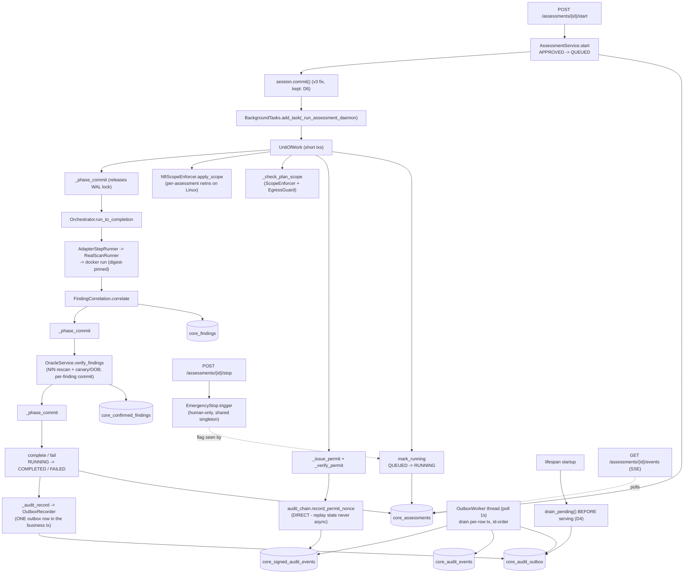

# SecOpent Integration Graph (v0.3.0)

> **Purpose:** the "built but not wired" meta-bug (W2/W3/W4) happened because
> no one could see the whole chain at once. This graph is the single source of
> truth for "what runs end-to-end when an assessment executes". **Every PR
> that touches a node or edge must update this file** (see the PR template).
> An edge without a test reference is a GAP and blocks release.

Baseline: v0.3.0 (UoW + phase commits + transactional outbox + BackgroundTasks).

## Assessment execution flow

## Edge coverage

| # | Edge | Covered by |
|---|---|---|
| 1 | start endpoint boundary (404/422/403) | `tests/interfaces/test_api_start.py` |
| 2 | APPROVED -> QUEUED + actor_role gate | `tests/application/test_execution.py::test_start_moves_approved_to_queued`, `::test_start_rejects_agent` |
| 3 | v3 ordering: daemon sees QUEUED, not stale APPROVED | `tests/interfaces/test_start_assessment_race.py::test_daemon_sees_queued_not_stale_approved` |
| 4 | BackgroundTasks wiring (executor + outbox recorder passed) | `tests/interfaces/test_assessments_outbox_wiring.py` |
| 5 | UnitOfWork commit/rollback/close semantics | `tests/infrastructure/test_unit_of_work.py` |
| 6 | QUEUED -> RUNNING -> COMPLETED/FAILED transitions | `tests/application/test_execution.py::test_mark_running_complete_fail_transitions` |
| 7 | permit sign + verify + replay nonce (direct, never async) | `tests/application/test_execution_gates.py::test_start_assessment_signs_permit_bound_to_scope_and_plan`, `tests/application/test_execution_outbox.py::test_permit_nonce_stays_direct_even_with_outbox` |
| 8 | scope/egress denial blocks + audits | `tests/application/test_execution_gates.py::test_scope_enforcer_denies_out_of_scope_target`, `::test_egress_guard_denies_cloud_metadata_target` |
| 9 | emergency-stop execution gate | `tests/application/test_execution_gates.py::test_execute_refuses_when_emergency_stop_triggered`, `tests/security/test_emergency_stop.py`, `tests/interfaces/test_emergency_stop_503.py` |
| 10 | per-assessment netns create/destroy (+ failure cleanup) | `tests/interfaces/test_assessment_netns_lifecycle.py` |
| 11 | phase commits release the WAL write lock during scans | `tests/infrastructure/test_realism_phase_commit.py` |
| 12 | orchestrator -> step runner -> findings persisted with assessment_id | `tests/application/test_execution.py::test_execute_assessment_correlates_findings_and_completes` |
| 13 | oracle N/N + canary echo/OOB + confirmed findings | `tests/application/test_oracle.py`, `tests/application/test_oracle_service.py`, `tests/application/test_execution_oracle.py` |
| 14 | outbox recorder joins caller tx / rollback drops row | `tests/infrastructure/test_outbox.py` |
| 15 | outbox routing in execution (all events, nonces excepted) | `tests/application/test_execution_outbox.py` |
| 16 | worker drain -> both audit tables, order, poison rows | `tests/infrastructure/test_outbox.py::test_worker_drains_to_both_audit_tables`, `::test_poison_row_flagged_and_neighbours_still_drain` |
| 17 | end-to-end outbox + crash-restart drain (D4) | `tests/infrastructure/test_realism_outbox.py` |
| 18 | AuditChain concurrency (daemon x request x worker) | `tests/application/test_audit_chain_thread_safety.py`, `tests/infrastructure/test_realism_concurrent_audit.py` |
| 19 | SSE status stream | `tests/interfaces/test_sse.py` |
| 20 | startup recovery (RUNNING/QUEUED -> FAILED) | `tests/interfaces/test_startup_recovery.py` |

## Rules

1. A PR that adds/removes/rewires an edge updates the Mermaid graph AND the
   coverage table in the same commit.
2. A new edge without a test reference is marked `**GAP**` and must be closed
   before the next release (GAPs are reviewed at every release gate).
3. Known GAPs today: none.
