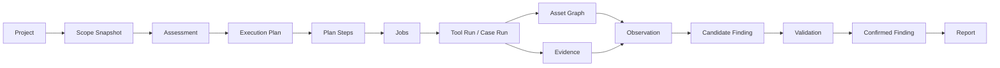
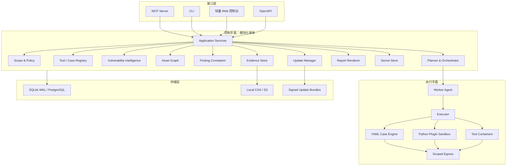

# SecOpent Agent-native 授权渗透测试工作台设计规范

- **状态**：已批准
- **日期**：2026-07-25
- **目标版本**：V1 / Beta
- **产品形态**：单用户、Agent-native、Web/API + 网络主机授权渗透测试工作台
- **架构决策**：模块化单体控制平面 + 隔离执行 Worker

## 1. 背景与决策

SecOpent 原定位偏向安全评估项目管理和交付控制面。新目标要求系统能够真正执行覆盖多个阶段的授权渗透测试，持续更新漏洞情报和扫描规则，允许用户编写检测用例，并能被 Codex、Claude Code 等 Agent 通过结构化协议直接调用。

本设计放弃继续在旧 `Run -> Observation -> Finding` 骨架上堆叠能力，选择重新定义领域核心，同时复用现有 Scope、Finding、Evidence、报告、Connector 和 Adapter 安全字段。V1 不采用微服务，也不建设插件市场；采用模块化单体控制平面、确定性安全策略和可独立部署的执行 Worker。

### 1.1 已批准的产品决策

1. 产品形态为单机 Agent 渗透工作台，而非第一版团队 SaaS。
2. V1 覆盖 Web/API 与网络主机任务。
3. 同时提供逐阶段审批模式和 Scope 内全自动模式。
4. 自定义用例采用 YAML DSL + 受控 Python Plugin。
5. 漏洞情报和用例支持在线与离线签名更新。
6. Agent 接口以 MCP Server 为主，CLI/OpenAPI 为辅。
7. 扫描能力采用成熟工具编排 + 自研用例引擎。
8. 数据处理本地优先，远程模型可选且必须脱敏、授权。
9. 同时支持 Lite 控制节点和 Standalone 完整部署。
10. MCP/CLI 为主，轻量 Web 控制台用于审批、观察、证据和报告。

## 2. 产品定义与边界

SecOpent V1 是面向授权渗透测试人员的 Agent-native 工作台。用户定义目标、授权范围、风险预算和执行模式；规则 Planner 生成基础计划，Agent 可以提出调整；确定性 Policy Engine 决定动作是否允许；Worker 在隔离环境中调用工具或用例；系统归一化资产、观察、漏洞和证据并生成可追溯报告。

### 2.1 核心优先级

1. 真正执行渗透测试任务。
2. Agent 可以安全、结构化地调用。
3. 用户可以编写、测试、审核和版本化渗透用例。
4. 漏洞情报、工具定义和用例可持续更新。
5. 每个确认漏洞都有不可变证据和复现路径。
6. 控制平面可以在 2C2G Lite 节点运行。

### 2.2 V1 任务覆盖

#### Scope 与授权

- 域名、通配域名、URL、IP、CIDR、端口和 URL 前缀；
- Include、Exclude、禁止资产和时间窗口；
- 请求速率、并发、总请求、最长执行时间；
- 登录、弱口令、漏洞验证、文件上传、状态变更和 OAST 授权；
- 凭据用途、数据保留和远程模型策略。

#### 资产发现

- DNS、子域名、IP/CIDR 主机发现；
- 端口和服务识别；
- TLS 证书、HTTP/HTTPS 可达性；
- 去重并生成资产关系。

#### Web/API 枚举

- Web 指纹、技术栈、目录和路径；
- 爬虫、JavaScript URL/API 提取；
- OpenAPI/Swagger、参数、登录入口和认证方式识别；
- 请求与响应样本收集。

#### 漏洞发现与安全验证

- CVE/版本匹配、CISA KEV 和 EPSS 优先级；
- nuclei、YAML Case、配置错误、弱 TLS、管理界面和信息泄漏；
- 在授权下执行无害的响应差异、反射、时间差、路径读取、OAST、文件标记和授权差异验证；
- 工具结果先成为 Observation/Candidate，不能仅凭版本匹配直接确认为漏洞。

#### 证据和报告

- 固定工具、用例、情报、Scope 和策略版本；
- 保存请求/响应摘要、原始产物、SHA-256、截图、参数、时间和可复现路径；
- 输出执行摘要、Scope、方法、资产、漏洞、证据、修复建议、未完成项和版本快照。

### 2.3 V1 不做

- 自动提权、横向移动和持久化；
- 恶意载荷生成、DoS、删除或破坏数据；
- 无线、移动端二进制、云 IAM 和 AD 全链路攻击；
- 大规模互联网测绘、多租户 SaaS 和复杂企业审批；
- 插件市场、Kubernetes 调度和 AI 自动修改目标系统。

这些能力未来只能作为独立 Capability Pack，并继续受 Scope、Policy 和审批约束。

## 3. 核心工作流



核心任务状态：

```text
DRAFT -> PLANNED -> AWAITING_APPROVAL -> APPROVED -> QUEUED
      -> RUNNING -> PAUSED -> COMPLETED / PARTIAL / FAILED / CANCELLED
```

步骤状态：

```text
PENDING -> BLOCKED -> READY -> LEASED -> RUNNING
        -> SUCCEEDED / FAILED / SKIPPED / POLICY_DENIED
```

一个 Assessment 固定以下快照：

```text
scope_snapshot_id
plan_version
policy_version
intel_snapshot_id
case_registry_snapshot_id
tool_registry_snapshot_id
engine_version
```

历史任务永不跟随 `latest` 漂移。

## 4. 总体架构



### 4.1 架构原则

- 控制平面不强制依赖 Docker；可由 Python、systemd、Windows Service 或容器运行。
- 扫描工具和 Python Plugin 默认由 Docker/Podman 隔离。
- Agent 不能获得任意 Shell、Docker 参数或 Python 执行入口。
- MCP、CLI、Web、API 共用同一 Application Service 和 Policy Engine。
- V1 使用数据库 Job Lease，不强制引入 Redis。
- Domain 不依赖 FastAPI、SQLAlchemy、MCP SDK、Docker 或 httpx。
- Worker 是确定性执行进程，不是 LLM Agent。

## 5. 控制平面模块

### 5.1 Scope 与 Policy

每次执行按以下顺序检查：

```text
Target Normalize -> Explicit Deny -> Include Match -> DNS Resolve
-> Resolved IP Recheck -> Port/URL -> Time Window -> Risk
-> Approval -> Budget -> Execution Permit
```

Deny 始终优先。DNS 解析后的地址必须重新检查，防止 DNS Rebinding。

### 5.2 Planner 与 Orchestrator

规则 Planner 生成确定性基础 DAG，Agent 只能提出新 Plan Version。已批准计划不可原地修改。Orchestrator 负责依赖、调度、Lease、重试、超时、暂停、恢复、幂等、预算和失败分类。

### 5.3 Tool Registry

Tool Definition 固定：

```text
id/version/image/image_digest/risk_class
input_schema/output_schema/parameter_schema
resource_limits/network_policy/parser/signature
```

Agent 只能填写 Schema 允许的参数，不能注入任意 CLI 参数。镜像使用 digest 固定，Parser 将输出转为标准 Observation。

V1 首批工具：nmap、httpx、nuclei、katana；amass 和 ZAP 在资源及网络策略验证后启用。

### 5.4 Case Registry

用例类型：YAML、Python、Composite。生命周期：

```text
DRAFT -> VALIDATED -> REVIEWED -> SIGNED -> PUBLISHED
      -> DISABLED / DEPRECATED
```

每个版本记录作者、风险、目标类型、Schema、前置条件、步骤、断言、Evidence、CWE/CVE/OWASP 映射、签名和最低引擎版本。

### 5.5 Vulnerability Intelligence

情报负责“什么漏洞存在”，Case 负责“如何安全检测”。来源包括 NVD/CVE、CISA KEV、OSV、EPSS、CWE、厂商公告和内部条目。每个字段保留来源，内部优先级不能覆盖原始记录。

### 5.6 Asset Graph

V1 用关系表表达节点和边：

```text
Domain -> resolves_to -> IP -> exposes -> Port -> runs -> Service
Service -> serves -> URL -> contains -> Endpoint -> uses -> Technology
```

不引入图数据库。

### 5.7 Finding Correlation

```text
Tool Result -> Observation -> Candidate -> Validation -> Confirmed Finding
```

指纹至少包含资产、服务、路径/参数、CWE/CVE 和 Case。不同工具的重复结果必须合并，证据保留来源。

### 5.8 Evidence Store

Evidence 使用内容寻址：`sha256/<prefix>/<digest>`。支持 Local CAS 和 S3/OSS/MinIO。数据库只保存哈希、大小、MIME、URI、敏感级别和来源。Evidence 分 RAW、REDACTED、SUMMARY；脱敏生成新对象，不覆盖原始对象。

### 5.9 Secret Store

任务只使用 `secret_ref`。Secret 由 OS Keyring、本机加密文件或外部 Secret Manager 保存；不进入 Prompt、Case、日志、Evidence 和报告。执行时以短时文件描述符、内存管道或 Secret Mount 注入。

## 6. 执行平面

### 6.1 Executors

```text
ContainerExecutor  生产默认，执行成熟工具和 Python Plugin
BuiltinExecutor    执行受控 YAML HTTP/TCP Case
ProcessExecutor    仅开发调试，默认关闭
```

后续可增加 Remote/Kubernetes/SSH Executor，但不进入 V1。

### 6.2 Worker 协议

Worker 通过 HTTPS 注册、心跳、Lease、续租和提交结果：

```text
POST /worker/register
POST /worker/heartbeat
POST /worker/jobs/lease
POST /worker/jobs/{id}/renew
POST /worker/jobs/{id}/complete
POST /worker/jobs/{id}/fail
PUT  /worker/evidence/{upload-token}
```

Job 字段至少包含 `idempotency_key`、attempt、max_attempts、lease_owner、lease_expires_at 和 result_digest。Worker 失联后 Lease 过期，Job 可安全重领。

### 6.3 Execution Permit

每个 Job 使用签名、短时 Permit，绑定 Job、Worker、Scope/Plan/Policy digest、工具/用例版本、目标、Capability、请求预算、有效时间和 nonce。Worker 必须检查签名、时间、Worker、版本、预算和重放。

### 6.4 Scoped Egress

工具不能使用无限制默认 Bridge，也不能统一 `network=none`。HTTP 工具通过 Scoped Egress Proxy；原始 TCP 工具使用专用 Network Namespace 和 nftables/iptables。始终阻止控制面、数据库、Docker Host、云 Metadata 和 Scope 外目标。

## 7. 双执行模式与风险

风险等级：Passive、Low、Active、Intrusive、Destructive。

| 风险 | Approval 模式 | Autopilot 模式 |
|---|---|---|
| Passive | 自动 | 自动 |
| Low | 自动 | 自动 |
| Active | 阶段批准 | Approval Envelope 内自动 |
| Intrusive | 用例组批准 | 必须在 Envelope 明确列出 |
| Destructive | 禁止 | 禁止 |

Scope Autopilot 只允许在任务启动时批准的目标、能力、风险、凭据、时间和请求预算内调整顺序。超界进入 `AWAITING_ADDITIONAL_APPROVAL`。

不可绕过规则包括：Scope 外目标、DoS、删除数据、持久化、未授权凭据喷洒、未声明第三方目标、未审核 Python、敏感 Evidence 外传。

## 8. YAML Case DSL

### 8.1 支持的动作

```text
dns.resolve, tcp.connect, tls.inspect
http.request, http.compare
oast.allocate, oast.wait
extract.regex, extract.jsonpath, extract.xpath
transform.base64, transform.urlencode, transform.hash
compare.text, compare.numeric, compare.timing
condition, foreach, retry, wait
```

`foreach/retry/wait` 必须有硬上限；禁止递归、无限循环、Shell、动态 import、任意文件路径和动态创建 Scope 外目标。

### 8.2 模板与断言

允许 `target.*`、asset、service、endpoint、credential_ref、previous_step、oast 和 case.parameters。断言使用内部 AST，不使用 Python `eval()`，支持比较、contains、matches、逻辑、长度和时间差。

### 8.3 风险静态分析

GET/HEAD 为 Low；全面扫描和爬虫为 Active；凭据、上传、时间差和 OAST 为 Intrusive；Shell、无限循环和 Scope 外目标拒绝发布。声明风险不得低于计算风险。

### 8.4 Fixture

每个 Case 必须覆盖 Positive、Negative、Timeout、异常响应、重定向、Scope Deny 和脱敏。Intrusive Case 还必须说明靶场、前后状态、清理和最大影响。

## 9. Python Plugin

Python Plugin 只能通过 `CaseContext` SDK 获取 scoped_http、scoped_tcp、credential_ref、temp filesystem 和 OAST 等声明式 Capability。禁止 subprocess、os.system、Docker Socket、宿主文件系统、任意 Socket 和数据库连接。

生命周期：

```text
DRAFT -> STATIC_CHECKED -> SANDBOX_TESTED -> REVIEWED -> SIGNED -> PUBLISHED
```

Agent 可以生成 Draft 和测试，但不能审核、签名、发布或提高 Capability。插件运行容器必须 read-only、non-root、cap-drop ALL、no-new-privileges、资源/超时限制、无 Host Network 和 Docker Socket。

## 10. 漏洞情报与更新

### 10.1 情报实体

- Vulnerability：canonical ID、alias、描述、CVSS、CWE、引用和时间；
- Affected Product：vendor/product/CPE/package/version range/fixed versions；
- Exploitation Signal：KEV、EPSS、公开利用、勒索和活跃利用；
- Detection Mapping：漏洞到 Case Version 的检测类型、风险和可信度。

V1 使用 SQLite FTS5 或 PostgreSQL 全文索引，不引入 Elasticsearch。

### 10.2 更新频率目标

| 来源 | 目标频率 |
|---|---:|
| CISA KEV | 6 小时 |
| NVD CVE API | 6～12 小时 |
| OSV | 6 小时 |
| FIRST EPSS | 每日 |
| CWE | 每月 |
| 厂商公告 | 6～24 小时 |
| Case/Tool Registry | 每日或手工 |

实际频率必须遵守来源限流和许可证。

### 10.3 Update Bundle

在线和离线使用同一 `tar.zst` Bundle，包含 manifest、Ed25519 签名、checksums、情报 NDJSON、Case、Tool Registry 和迁移。更新流程：

```text
下载/导入 -> 签名/Hash -> Staging DB -> Schema/兼容/Case 检查
-> 变更预览 -> 原子激活 -> 保留旧快照 -> 可回滚
```

纯情报可自动应用；Active Case 安装后等待启用；Intrusive Case 必须审核；Python Plugin 永不自动启用；Tool digest 切换前执行 smoke test。

## 11. MCP、CLI、Web 与 API

### 11.1 MCP

MCP 工具分项目/Scope、计划/执行、资产、用例/工具、漏洞/证据和更新/报告六组。关键工具包括：

```text
project_create, scope_draft, scope_validate, scope_freeze
plan_generate, plan_preview, plan_update, plan_approve
assessment_start, pause, resume, cancel, status
asset_list, service_list, endpoint_list
case_search, get, create_draft, validate, publish
tool_list, tool_describe
finding_list, get, validate, mark_false_positive
intel_search, evidence_get_metadata, evidence_export
update_check, preview, apply, rollback
report_render, report_export
```

禁止暴露 shell、docker_run、execute_python。所有调用绑定 Project、Scope、Plan、Policy、Approval 和 Audit Event。

### 11.2 CLI

主命令：`init/serve/worker/project/scope/assessment/tool/case/intel/update/finding/evidence/report/doctor`。CLI 只调用 Application Service。

### 11.3 Web

V1 只实现 Dashboard、New Assessment、Assessment Detail、Approval Center、Findings、Case Studio 和 Updates 七个页面。Case Studio 提供 YAML 编辑、Schema、风险、Fixture、Dry Run、Diff、审核和签名；不提供浏览器任意代码执行。

### 11.4 API

资源 API 覆盖 projects、scopes、assessments、plans、approvals、workers、jobs、tools、cases、intel、assets、findings、evidence、updates、reports 和 audit。长任务返回 ID，状态使用 SSE；V1 不需要 WebSocket。

## 12. Agent 与数据安全

### 12.1 Prompt Injection

目标页面、Banner、工具输出和漏洞描述均标记为 `untrusted_target_output`。Agent 输出必须转为结构化 Action，再经过 Schema、Scope、Policy、Approval 和 Registry；目标内容不能修改策略、Scope、用例状态、Secret 或审批。

### 12.2 远程模型

数据分 Public、Internal、Sensitive、Restricted、Secret。远程模型调用统一经过 Data Classification、Redaction、Policy、User Consent 和 Audit。Secret 永不发送，Restricted 默认禁止，Sensitive 默认脱敏。本地模式不依赖 LLM 也能执行扫描。

### 12.3 Audit

Audit 记录 Scope、Plan、审批、Secret 使用、工具/用例、Policy Deny、Evidence 导出、用例发布、更新、远程模型、Finding 和报告。事件包含 previous_event_hash/event_hash，提供篡改检测但不宣称不可篡改存储。

### 12.4 Emergency Stop

Emergency Stop 停止签发 Permit、撤销未使用 Permit、终止活动容器、保留 Evidence 并写入高优先级 Audit。

## 13. 数据模型摘要

核心表：

```text
projects
scope_drafts, scope_snapshots
assessments, execution_plans, plan_steps, approvals
workers, jobs, execution_permits
tool_definitions
case_definitions, case_versions
intel_snapshots, vulnerabilities, vulnerability_aliases
affected_products, exploitation_signals, detection_mappings
asset_nodes, asset_edges
observations, findings
evidence_objects, finding_evidence
update_bundles, secret_metadata, audit_events
```

Lite 默认 SQLite WAL，Remote Worker/团队模式可选 PostgreSQL。业务代码不得依赖 SQLite 专有逻辑；Repository Contract 必须同时在 SQLite/PostgreSQL 运行。Evidence 不存数据库 BLOB。

## 14. 部署模型

### 14.1 Lite：2C2G 控制节点

运行 API、MCP、Web、SQLite WAL、情报索引、Update Manager 和 Local CAS/外部 S3；扫描由 Remote Worker 执行。目标内存约 0.8～1.4GB，不运行 ZAP、大规模扫描、Python Plugin 或镜像构建。

### 14.2 Standalone

同机运行控制平面、本地 Worker、Tool Containers 和 CAS。最低 4C8G，推荐 8C16G 和 100GB SSD；启用 ZAP 或并发任务时使用推荐规格。

Redis 不是 V1 必需依赖。Worker 数量超过约 10、Job 高并发或需要毫秒级调度时，再评估专用队列。

## 15. 错误模型与可观测性

统一错误码分 Policy、Execution 和 Update：

```text
SCOPE_DENIED, TARGET_EXCLUDED, OUTSIDE_TIME_WINDOW
RISK_NOT_APPROVED, CAPABILITY_NOT_APPROVED, BUDGET_EXHAUSTED
WORKER_UNAVAILABLE, JOB_LEASE_EXPIRED, PERMIT_INVALID
TOOL_TIMEOUT, TOOL_RESOURCE_LIMIT, TOOL_OUTPUT_INVALID
PLUGIN_SANDBOX_VIOLATION
BUNDLE_SIGNATURE_INVALID, ENGINE_INCOMPATIBLE
CASE_SCHEMA_INVALID, ACTIVATION_FAILED
```

错误必须标注可重试性、用户动作、影响范围和部分结果保留策略。

结构化日志包含 request/project/assessment/plan/step/job/worker/permit/tool/case、耗时和错误码，不记录 Secret、Cookie、Authorization 和完整敏感正文。指标覆盖 Assessment、Job、重试、Policy Deny、工具/用例、Finding、Evidence、更新和 Worker 心跳。

## 16. 测试与安全验收

### 16.1 测试层次

- 单元：Scope、Policy、DSL AST、风险、Finding 指纹、Evidence、Bundle、脱敏；
- Contract：SQLite/PostgreSQL、MCP/API/CLI、Worker、Parser、SDK、Local/S3；
- 安全：恶意 YAML、Alias Bomb、压缩炸弹、路径穿越、SSRF、DNS Rebinding、Prompt Injection、Permit 重放、Worker 冒充；
- E2E：隔离的 httpbin、自建 fixtures、Juice Shop、crAPI、模拟 TCP/OAST；
- Agent Eval：工具选择、Scope、证据充分性、风险升级、Secret 和 Prompt Injection。

### 16.2 必须通过的安全条件

1. Scope 外地址在 Worker 网络层被拒绝；
2. DNS 解析结果重新校验；
3. Agent 不能执行任意 Shell；
4. 未批准 Active/Intrusive Case 被拒绝；
5. 过期或跨 Worker Permit 被拒绝；
6. 工具不能访问数据库、Docker Host 和云 Metadata；
7. Secret 不出现在日志、Evidence 和 MCP；
8. Prompt Injection 不能改变 Plan；
9. Python Plugin 不能访问 Docker Socket；
10. 远程模型发送前完成脱敏和授权；
11. Emergency Stop 停止活动任务；
12. Audit Hash Chain 断裂可检测；
13. 错误签名 Bundle 被拒绝；
14. 历史 Assessment 固定所有版本。

## 17. 代码结构与依赖方向

```text
src/secopent/
  domain/
    projects/ scope/ assessments/ assets/ findings/
    evidence/ cases/ intel/ updates/ policy/
  application/
    projects/ assessments/ planning/ execution/
    cases/ findings/ updates/ reports/
  infrastructure/
    db/ repositories/ evidence/ secrets/ signing/ updates/ telemetry/
  execution/
    worker/ permits/ executors/ case_engine/
    plugin_sdk/ parsers/ network_policy/
  interfaces/
    mcp/ cli/ api/ web/
  integrations/
    tools/ intel_sources/ connectors/
```

依赖方向：interfaces -> application -> domain；infrastructure、execution 和 integrations 通过 ports/contracts 接入。Domain 不反向依赖基础设施。

## 18. 现有代码迁移

不推倒重来。迁移顺序：Scope/Snapshot -> Evidence -> Finding -> Report -> Adapter Manifest -> Worker -> Connectors -> API。迁移期提供 LegacyRunAdapter、LegacyFindingRepository 和 LegacyReportRenderer；兼容层可依赖新核心，新核心禁止依赖旧 Service。

概念映射：

| 现有 | 新核心 |
|---|---|
| Engagement | Project |
| Run | Assessment / Execution Plan |
| Adapter | Tool Definition |
| Observation | Observation / Tool Result |
| Connector | Integration |
| Worker runtime | Worker Agent |
| Report Service | Report Renderer + Export |

多租户 SaaS、完整 RBAC、复杂客户层级暂时冻结，不立即删除。

## 19. 实施里程碑

### M0 新架构基线（3～5 日）

Domain、Repository Protocol、SQLite WAL、Project/Scope/Assessment、Policy Engine 和兼容边界。验收：Scope 硬拒绝，Plan 可持久化，Approval 可运行空计划。

### M1 Worker 与工具（5～8 日）

Worker、Job Lease、Permit、Container/Builtin Executor、Tool Registry、nmap/httpx/nuclei、Local CAS、Lite/Standalone。验收：2C2G Lite 调度 Remote Worker，网络 Scope 和幂等通过。

### M2 用例引擎（5～7 日）

YAML DSL、Assertion AST、Fixture、风险分析、Case Registry/Snapshot、Python SDK/沙箱原型和 CLI。验收：Agent 生成 Draft，未审核 Python 无法发布。

### M3 情报与更新（5～7 日）

NVD、KEV、OSV、EPSS、FTS、Bundle、Ed25519、Staging/激活/回滚、在线/离线。验收：错误签名拒绝，历史快照稳定，Lite 可增量更新。

### M4 Agent、Web 与报告（5～7 日）

MCP、CLI、轻量 Web、规则 Planner、Agent Plan Version、Finding Correlation、Evidence 脱敏和报告。验收：Approval/Autopilot 完整闭环及 Prompt Injection 测试。

### M5 安全加固与 Beta（5～8 日）

Scoped Egress、Secret、Audit Hash Chain、Emergency Stop、Remote Model Gateway、PostgreSQL Contract、E2E、CI、Coverage、SBOM 和安装升级文档。

单人全职估算：可运行原型 1～2 周，真实 Alpha 3～4 周，完整 V1 5～7 周，安全 Beta 7～9 周，总计约 28～42 个有效工程日。

## 20. V1 完成定义

- Agent 可通过 MCP 创建、规划、审批和执行 Assessment；
- Approval 和 Scope Autopilot 可切换；
- Worker 网络层阻止 Scope 外目标；
- 支持 nmap、httpx、nuclei 和 YAML Case；
- Python Plugin 审核、签名、沙箱执行；
- 支持 CVE、KEV、OSV、EPSS；
- 在线/离线签名更新可预览、激活、回滚；
- 历史任务固定情报、用例、工具、策略版本；
- Agent 不获得任意 Shell；
- Prompt Injection 不能改变计划；
- Secret 不进入 Agent、日志和 Evidence；
- 每个 Confirmed Finding 有不可变 Evidence；
- Lite 可在 2C2G 运行，Standalone 可在 4C8G 运行；
- Markdown/HTML 报告和完整隔离 E2E 通过。

## 21. 关键取舍记录

1. **模块化单体而非微服务**：V1 单用户和小规模 Worker 不值得承担分布式复杂度。
2. **SQLite 默认、PostgreSQL 可选**：满足 2C2G 和个人工作台，同时保留扩展路径。
3. **数据库 Lease 而非 Redis**：减少部署依赖；规模扩大后通过 Repository 替换。
4. **工具编排而非自研全部扫描器**：把工程投入用于安全边界、用例、证据和 Agent 工作流。
5. **YAML + Python 双层用例**：兼顾 Agent 可生成性和复杂场景，自由代码必须审核隔离。
6. **情报与用例分离**：更新 CVE 不等于自动安装执行能力。
7. **控制平面不强制 Docker**：2C2G Lite 可运行；工具和插件仍使用容器隔离。
8. **确定性 Policy 高于 Agent**：安全不能依赖 Prompt。
9. **版本快照优先**：更新及时性不能破坏历史可复现性。
10. **本地优先**：远程模型是可选增强，不是扫描运行时依赖。
