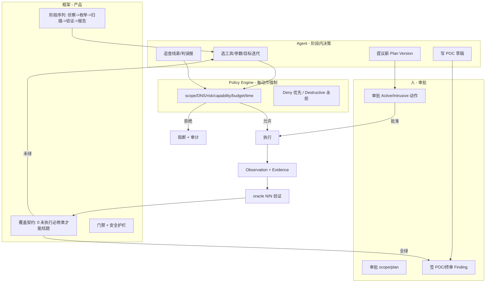
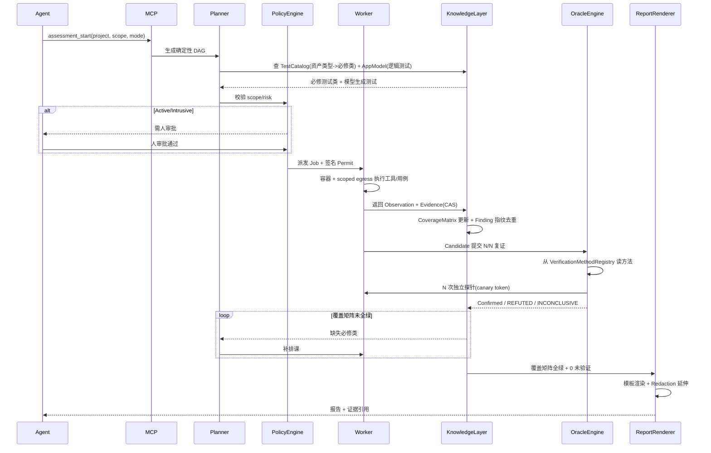
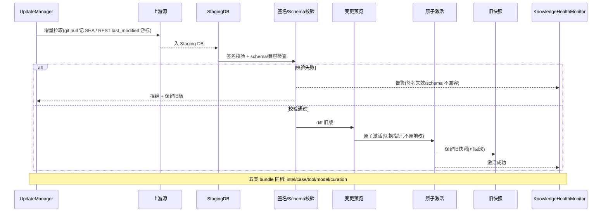
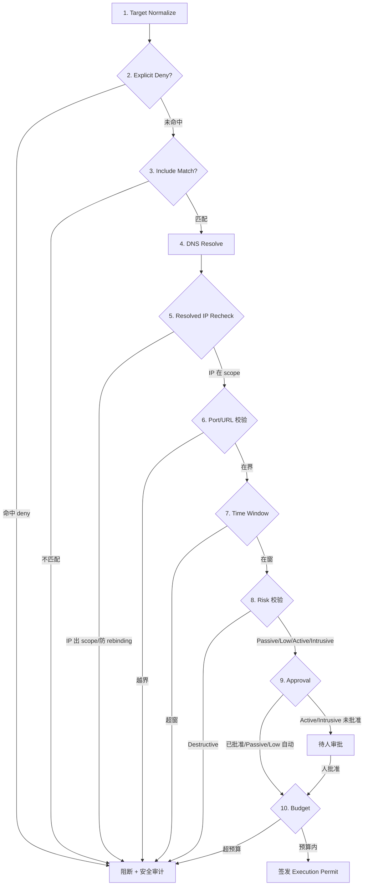
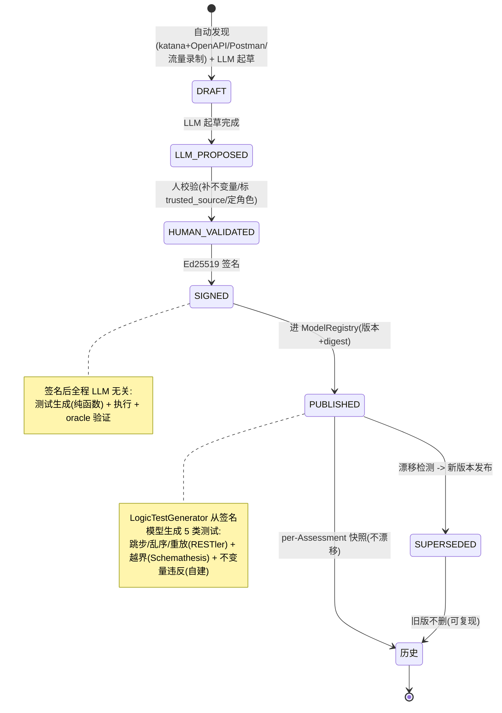
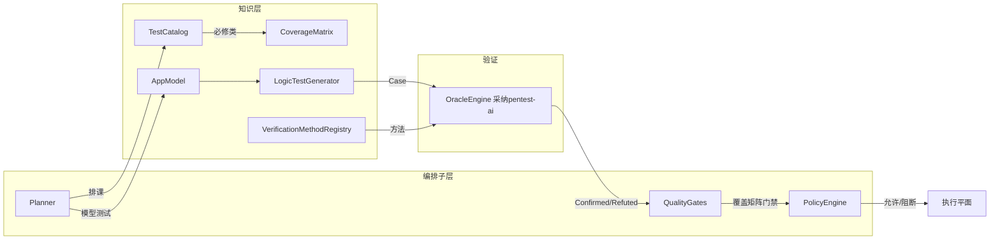

# 架构详图（Mermaid）

> 配套主文档 `2026-07-25-catalog-driven-agent-workbench-design.md` 的可视化视图。
> 本文件收录 D2 的 5 张关键图：三方分工、Assessment 流程、Update Bundle 同步、Scope 强制链、AppModel 生命周期。
> 仅用于合法授权渗透测试与防御性安全用途。

---

## 1. 三方分工（§3 架构脊柱）

框架铺路、agent 驾驶、Policy 刹车、人审批。覆盖契约硬卡结题。

**关键约束**：Agent 只能 ADD（参数化/追查/提议 POC），不能 SUBTRACT 必修类；Policy Engine 确定性裁决，不靠 LLM 自律；人审是不可绕过的发布/高风险门禁。

---

## 2. 一次 Assessment 完整流程（§6.4）

---

## 3. Update Bundle 同步时序（§10.3）

---

## 4. Scope 强制执行链（§12.4，10 步）

Deny 始终优先；DNS 解析后二次校验防 rebinding；API + 执行层双重校验。

---

## 5. AppModel 生命周期状态机（§11.9）

LLM proposes, human disposes, product executes。LLM 仅第 1 步辅助起草，人校验签名，执行全程 LLM 无关。

---

## 6. 确定性脊柱九模块（§6.2）

LLM 无关，结果质量的责任方。LLM 关掉仍能跑出完整基线报告。

---

*本文件配合主文档使用。所有图编号对应主文档章节号。*
